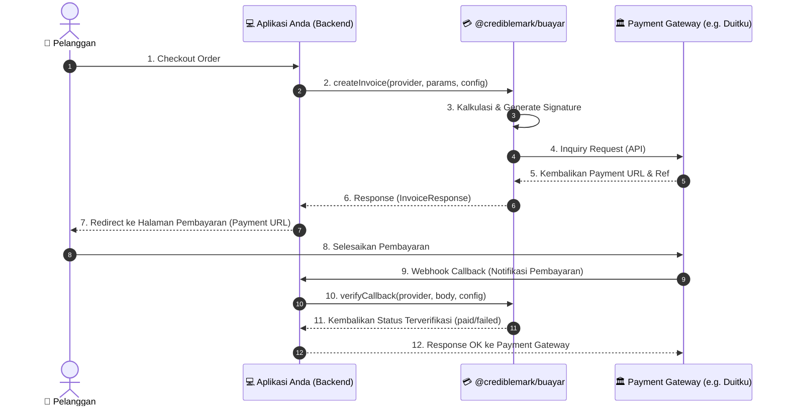

# 💳 @crediblemark/buayar

[](https://www.npmjs.com/package/@crediblemark/buayar)
[](https://opensource.org/licenses/MIT)

**`@crediblemark/buayar`** adalah Unified Payment Gateway SDK untuk Node.js dan TypeScript yang dirancang untuk mempermudah integrasi berbagai gerbang pembayaran (Payment Gateway) dengan satu struktur API yang seragam.

Dengan SDK ini, Anda cukup menulis kode satu kali menggunakan struktur API yang konsisten untuk mengelola pembuatan invoice/transaksi serta verifikasi callback webhook dari berbagai penyedia layanan payment gateway.

---

## 🚀 Fitur Utama

- 🔄 **Unified API**: Satu antarmuka (interface) terpadu untuk semua provider payment gateway.
- 🛡️ **Tipe Data Kuat (TypeScript)**: Dilengkapi dengan deklarasi tipe data lengkap untuk mencegah *runtime error*.
- 🇮🇩 **Dukungan Lokal**: Siap digunakan untuk transaksi di Indonesia (seperti Duitku).
- ⚙️ **Modular & Dapat Diperluas**: Memungkinkan penambahan provider baru dengan mewarisi kelas base yang disediakan.
- 🔒 **Otomatisasi Signature**: Keamanan transaksi terjamin dengan pembuatan *hash* signature (MD5, SHA-256) otomatis secara internal.

---

## 📦 Instalasi

Instal package menggunakan manajer paket pilihan Anda:

```bash
# Menggunakan Bun (Sangat Direkomendasikan)
bun add @crediblemark/buayar

# Menggunakan NPM
npm install @crediblemark/buayar

# Menggunakan Yarn
yarn add @crediblemark/buayar

# Menggunakan PNPM
pnpm add @crediblemark/buayar
```

---

## 🗺️ Alur Proses Pembayaran



---

## 🛠️ Integrasi & Penggunaan

### 1. Inisialisasi & Membuat Transaksi (Invoice)

Berikut adalah contoh pembuatan transaksi menggunakan provider **Duitku**:

```typescript
import { paymentManager } from "@crediblemark/buayar";

const providerName = "duitku";

// Konfigurasi Kredensial Provider
const providerConfig = {
  merchantCode: "DXXXX",         // Merchant Code dari Duitku
  apiKey: "xxxxxxxxxxxxxxxx",    // API Key / Merchant Key Anda
  sandbox: true,                 // Set true untuk development / testing
};

// Parameter Invoice / Pembayaran
const invoiceParams = {
  orderId: "ORDER-100249",
  amount: 150000,                // Nominal transaksi (Rupiah)
  productDetails: "Pembelian Template Landing Page Premium",
  customer: {
    name: "Rasyiqi Crediblemark",
    email: "rasyiqi@crediblemark.com",
    phone: "081234567890",       // Opsional
  },
  returnUrl: "https://situsbisnis.com/payment/success",
  callbackUrl: "https://api.situsbisnis.com/v1/payment/callback",
};

async function handleCheckout() {
  try {
    const result = await paymentManager.createInvoice(
      providerName,
      invoiceParams,
      providerConfig
    );

    if (result.success) {
      console.log("Invoice Berhasil Dibuat! 🎉");
      console.log("URL Pembayaran:", result.paymentUrl);
      console.log("Referensi Gateway:", result.reference);
      
      // Redirect pelanggan ke paymentUrl
      // response.redirect(result.paymentUrl);
    } else {
      console.error("Gagal membuat invoice:", result.error);
    }
  } catch (error) {
    console.error("Terjadi kesalahan:", error);
  }
}

handleCheckout();
```

### 2. Verifikasi Callback / Webhook Notifikasi

Gunakan fungsi ini di endpoint API callback/webhook untuk memastikan data notifikasi yang dikirim oleh Payment Gateway valid dan tidak dimanipulasi:

```typescript
import { paymentManager } from "@crediblemark/buayar";

// Endpoint API Webhook Handler
async function handlePaymentCallback(req: any, res: any) {
  const providerName = "duitku";
  const callbackPayload = req.body; // Payload POST dari gateway
  
  const providerConfig = {
    merchantCode: "DXXXX",
    apiKey: "xxxxxxxxxxxxxxxx",
    sandbox: true,
  };

  try {
    const verification = await paymentManager.verifyCallback(
      providerName,
      callbackPayload,
      providerConfig
    );

    if (verification.isValid) {
      console.log(`Signature valid untuk Order: ${verification.orderId}`);
      
      if (verification.status === "paid") {
        console.log("Status: PEMBAYARAN SELESAI & LUNAS! ✅");
        // Update database Anda: ubah status order menjadi LUNAS
      } else if (verification.status === "failed") {
        console.log("Status: PEMBAYARAN GAGAL ❌");
        // Update database: ubah status order menjadi GAGAL
      }
      
      // Kirim respon sukses ke Payment Gateway (Duitku meminta respon plaintext OK)
      res.status(200).send("OK");
    } else {
      console.warn("Peringatan: Signature callback tidak valid! Potensi manipulasi data.");
      res.status(400).send("Bad Signature");
    }
  } catch (error) {
    console.error("Gagal memproses callback:", error);
    res.status(500).send("Internal Server Error");
  }
}
```

---

## 🗂️ Referensi API

### `PaymentManager`

#### `createInvoice(providerName, params, config)`
Membuat transaksi baru ke gerbang pembayaran tertentu.
- **`providerName`**: `string` - Nama provider payment gateway (contoh: `'duitku'`).
- **`params`**: `CreateInvoiceParams` - Data invoice dan detail pelanggan.
- **`config`**: `ProviderConfig` - Kredensial merchant dan API key.
- **Return**: `Promise<InvoiceResponse>`

#### `verifyCallback(providerName, body, config)`
Memvalidasi signature webhook callback dari payment gateway.
- **`providerName`**: `string` - Nama provider payment gateway (contoh: `'duitku'`).
- **`body`**: `any` - Payload callback mentah dari request body.
- **`config`**: `ProviderConfig` - Kredensial merchant dan API key.
- **Return**: `Promise<VerifyCallbackResult>`

---

## 📐 Spesifikasi Interface (TypeScript)

### `CreateInvoiceParams`
```typescript
interface CreateInvoiceParams {
  orderId: string;
  amount: number;
  productDetails: string;
  customer: {
    name: string;
    email: string;
    phone?: string;
  };
  returnUrl: string;
  callbackUrl: string;
}
```

### `InvoiceResponse`
```typescript
interface InvoiceResponse {
  success: boolean;
  paymentUrl?: string;
  reference?: string;
  rawResponse: any;
  error?: string;
}
```

### `VerifyCallbackResult`
```typescript
interface VerifyCallbackResult {
  isValid: boolean;
  orderId: string;
  amount: number;
  status: "paid" | "pending" | "failed";
  rawPayload: any;
}
```

---

## 📄 Lisensi

Proyek ini dilisensikan di bawah **MIT License**. Hak Cipta © 2026 Rasyiqi Crediblemark.
