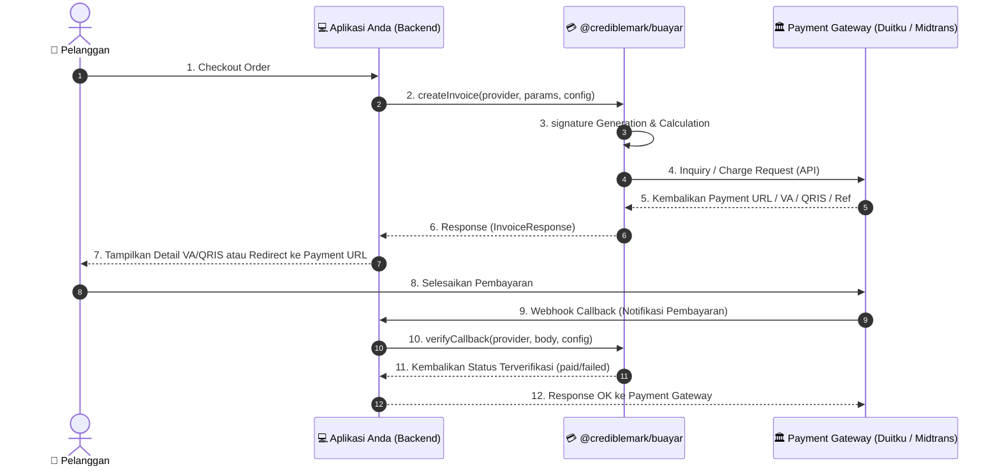

# 💳 @crediblemark/buayar

[](https://www.npmjs.com/package/@crediblemark/buayar)
[](https://opensource.org/licenses/MIT)

**`@crediblemark/buayar`** adalah Unified Payment Gateway SDK untuk Node.js dan TypeScript yang dirancang untuk mempermudah integrasi berbagai gerbang pembayaran (Payment Gateway) di Indonesia menggunakan satu struktur API yang seragam.

Dengan SDK ini, Anda cukup menulis kode satu kali menggunakan struktur API yang konsisten untuk mengelola pembuatan transaksi, pengecekan status transaksi, query metode pembayaran, serta verifikasi callback webhook dari berbagai penyedia layanan payment gateway.

---

## 🚀 Fitur Utama

- 🔄 **Unified API**: Satu antarmuka (interface) terpadu untuk semua provider payment gateway.
- ⚡ **Direct Payment Support**: Otomatis mendeteksi `paymentMethod` dan beralih ke Direct Inquiry API Duitku atau Core API Midtrans untuk mengembalikan `vaNumber`, `qrString` (EMVCo), dan `paymentCode` secara instan tanpa redirect eksternal.
- 🏷️ **Pre-Categorization (Accordion Ready)**: Menyediakan pengelompokan pembayaran bawaan (`Virtual Account`, `QRIS`, `E-Wallet`, `Retail / Gerai`, `Kartu Kredit`, `Paylater / Cicilan`, `Lainnya`) langsung dari API response untuk memudahkan implementasi UI accordion.
- 🎨 **Headless SDK Philosophy**: Dirancang murni sebagai core logic & data manager tanpa overhead UI/styling. Memberikan kebebasan penuh bagi pengembang untuk mendesain UI/Tailwind/dark mode di tingkat aplikasi.
- 🛡️ **Tipe Data Kuat (TypeScript)**: Dilengkapi dengan deklarasi tipe data lengkap untuk mencegah *runtime error*.
- ⚙️ **Modular & Dapat Diperluas**: Memungkinkan penambahan provider baru dengan mewarisi kelas base yang disediakan.
- 🔒 **Otomatisasi Signature**: Keamanan transaksi terjamin dengan pembuatan *hash* signature (MD5, SHA-256, SHA-512) otomatis secara internal.

---

## 📦 Provider yang Didukung

SDK ini mendukung beberapa provider payment gateway terkemuka di Indonesia. Silakan merujuk ke dokumentasi detail untuk masing-masing provider:

* 🏛️ **[Integrasi Duitku (docs/duitku.md)](file:///media/rasyiqi/PROJECT/credibuild-project/buayar/docs/duitku.md)**
  * Mendukung Redirect Checkout & Direct Inquiry (VA, QRIS, Retail Code langsung).
  * Verifikasi callback otomatis (signature MD5).
  * Penelusuran status transaksi & query metode pembayaran dinamis.

* 🏛️ **[Integrasi Midtrans (docs/midtrans.md)](file:///media/rasyiqi/PROJECT/credibuild-project/buayar/docs/midtrans.md)**
  * Mendukung Snap API (Redirect Checkout) & Core API (Direct Charge VA, QRIS, E-Wallet, Retail, Kartu Kredit, Paylater).
  * Verifikasi callback otomatis (signature SHA-512).
  * Dilengkapi ekstensi `MidtransClient` untuk fitur transaksi pasca-bayar (refund, cancel, subscription recurring, balance check, payment link, gopay tokenization, invoicing).

---

## ⚙️ Instalasi

Instal package menggunakan manajer paket pilihan Anda:

```bash
# Menggunakan Bun (Sangat Direkomendasikan)
bun add @crediblemark/buayar

# Menggunakan NPM
npm install @crediblemark/buayar

# Menggunakan Yarn
yarn add @crediblemark/buayar

# Menggunakan PNPM
pnpm add @crediblemark/buayar
```

### Instalasi dari GitHub Packages (Alternatif)

Package ini juga tersedia di [GitHub Packages](https://github.com/crediblemark-official/Buayar/packages). Buat file `.npmrc` di root project Anda:

```ini
@crediblemark:registry=https://npm.pkg.github.com/
//npm.pkg.github.com/:_authToken=${GITHUB_TOKEN}
```

Kemudian install seperti biasa:

```bash
bun add @crediblemark/buayar
```

> **Catatan:** Anda memerlukan GitHub Personal Access Token (PAT) dengan scope `read:packages` yang di-set sebagai environment variable `GITHUB_TOKEN`.

---

## 🗺️ Alur Proses Pembayaran



---

## 📐 Spesifikasi Interface (TypeScript)

### `CreateInvoiceParams`
```typescript
interface CreateInvoiceParams {
  orderId: string;
  amount: number;
  productDetails: string;
  customer: {
    name: string;
    email: string;
    phone?: string;
  };
  returnUrl: string;
  callbackUrl: string;
  paymentMethod?: string; // Opsional: Kode pembayaran untuk direct charge (contoh: "BCA", "bca_va", "qris")
  providerParams?: any;   // Opsional: Parameter tambahan spesifik provider
}
```

### `InvoiceResponse`
```typescript
interface InvoiceResponse {
  success: boolean;
  paymentUrl?: string;     // URL checkout halaman pembayaran (jika menggunakan redirect)
  reference?: string;      // ID Referensi transaksi / token Snap dari gateway
  vaNumber?: string;       // Nomor Virtual Account jika menggunakan VA instan
  qrString?: string;       // Data string QRIS mentah (EMVCo) untuk scan QR langsung
  qrCodeUrl?: string;      // URL gambar QR Code
  paymentCode?: string;    // Kode pembayaran retail (Indomaret/Alfamart)
  rawResponse: any;        // Payload respons mentah dari API gateway
  error?: string;          // Pesan kegagalan jika success = false
}
```

### `PaymentMethod`
```typescript
interface PaymentMethod {
  paymentMethod: string;
  paymentName: string;
  paymentImage: string;
  totalFee: string;
  category: "Virtual Account" | "QRIS" | "E-Wallet" | "Retail / Gerai" | "Kartu Kredit" | "Paylater / Cicilan" | "Lainnya";
}
```

---

## 📄 Lisensi

Proyek ini dilisensikan di bawah **MIT License**. Hak Cipta © 2026 Rasyiqi Crediblemark.
