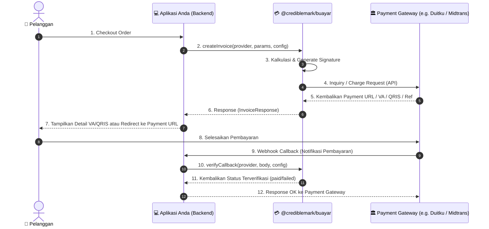

# 💳 @crediblemark/buayar

[](https://www.npmjs.com/package/@crediblemark/buayar)
[](https://opensource.org/licenses/MIT)

**`@crediblemark/buayar`** adalah Unified Payment Gateway SDK untuk Node.js dan TypeScript yang dirancang untuk mempermudah integrasi berbagai gerbang pembayaran (Payment Gateway) di Indonesia menggunakan satu struktur API yang seragam.

Dengan SDK ini, Anda cukup menulis kode satu kali menggunakan struktur API yang konsisten untuk mengelola pembuatan invoice/transaksi, pengecekan status transaksi, query metode pembayaran, serta verifikasi callback webhook dari berbagai penyedia layanan payment gateway.

---

## 🚀 Provider & Fitur yang Didukung

SDK ini mendukung provider payment gateway berikut secara out-of-the-box:

### 1. **Duitku** (`duitku`)
* **Redirect Checkout**: Membuat transaksi dan mengarahkan pengguna ke halaman checkout Duitku.
* **Direct Inquiry (Direct Charge / API v2/inquiry)**: Mengirim kode metode pembayaran spesifik (`paymentMethod`) untuk mendapatkan nomor Virtual Account (`vaNumber`), string QRIS (`qrString`), URL QRIS (`qrCodeUrl`), atau kode retail (`paymentCode`) secara instan tanpa redirect eksternal.
* **Get Payment Methods**: Mengambil metode pembayaran aktif beserta biaya transaksi (fee) secara dinamis dari API Duitku.
* **Check Status**: Memeriksa status transaksi terkini secara berkala atau manual (`transactionStatus`).
* **Webhook Callback Verification**: Memvalidasi signature callback menggunakan algoritma MD5.

### 2. **Midtrans** (`midtrans`)
* **Snap API (Redirect Checkout)**: Jika `paymentMethod` dikosongkan, SDK akan otomatis menggunakan Snap API untuk menghasilkan token pembayaran dan `paymentUrl` halaman Snap Midtrans.
* **Core API (Direct Charge / API /charge)**: Jika `paymentMethod` diisi dengan salah satu metode yang didukung, SDK akan langsung memproses pembayaran menggunakan Core API Midtrans untuk mendapatkan respons instan (`vaNumber`, `qrString`/`qrCodeUrl` untuk QRIS, `paymentCode` untuk retail, atau deep link redirect untuk e-wallet/paylater).
  * *Metode transfer bank*: `bca_va`, `bni_va`, `bri_va`, `permata_va`, `cimb_va`, `danamon_va`, `bsi_va`, `seabank_va`, `mandiri_va` (echannel).
  * *Metode QRIS & E-Wallet*: `qris`, `gopay`, `shopeepay`, `ovo`, `dana`, `linkaja`.
  * *Metode Retail / Gerai*: `alfamart`, `indomaret`.
  * *Metode Kartu*: `credit_card`, `googlepay` (memerlukan token pembayaran).
  * *Metode Paylater*: `kredivo`, `akulaku`.
* **Get Payment Methods**: Mengembalikan daftar metode pembayaran statis yang umum didukung oleh Midtrans beserta estimasi biaya (fee) dan kategorinya.
* **Check Status**: Memeriksa status transaksi di Midtrans (`/v2/{order_id}/status`).
* **Webhook Callback Verification**: Memvalidasi signature callback menggunakan algoritma SHA-512.
* **Midtrans Client Extension (`MidtransClient`)**: Client khusus untuk mengakses fitur API lanjutan Midtrans seperti:
  * Tindakan Transaksi: `cancel`, `refund`, `expire`, `approve`, `deny`, `capture`.
  * GOPAY Tokenization API: `linkPayAccount`, `getPayAccount`, `unbindPayAccount`, `getGoPayPromo`.
  * Subscription API (Recurring): `createSubscription`, `getSubscription`, `updateSubscription`, `disableSubscription`, `enableSubscription`.
  * Payment Link API: `createPaymentLink`, `getPaymentLink`, `deletePaymentLink`.
  * Invoicing API: `createBillingInvoice`, `getBillingInvoice`, `voidBillingInvoice`, `convertBillingInvoice`.
  * Balance API (IRIS / Core).

---

## 🚀 Fitur Utama SDK
 
- 🔄 **Unified API**: Satu antarmuka (interface) terpadu untuk semua provider payment gateway.
- ⚡ **Direct Payment Support**: Otomatis mendeteksi `paymentMethod` dan beralih ke Direct Inquiry API Duitku atau Core API Midtrans untuk mengembalikan `vaNumber`, `qrString` (EMVCo), dan `paymentCode` secara instan tanpa redirect eksternal.
- 🏷️ **Pre-Categorization (Accordion Ready)**: Menyediakan pengelompokan pembayaran bawaan (`Virtual Account`, `QRIS`, `E-Wallet`, `Retail / Gerai`, `Kartu Kredit`, `Paylater / Cicilan`, `Lainnya`) langsung dari API response untuk memudahkan implementasi UI accordion.
- 🎨 **Headless SDK Philosophy**: Dirancang murni sebagai core logic & data manager tanpa overhead UI/styling. Memberikan kebebasan penuh bagi pengembang untuk mendesain UI/Tailwind/dark mode di tingkat aplikasi.
- 🛡️ **Tipe Data Kuat (TypeScript)**: Dilengkapi dengan deklarasi tipe data lengkap untuk mencegah *runtime error*.
- ⚙️ **Modular & Dapat Diperluas**: Memungkinkan penambahan provider baru dengan mewarisi kelas base yang disediakan.
- 🔒 **Otomatisasi Signature**: Keamanan transaksi terjamin dengan pembuatan *hash* signature (MD5, SHA-256, SHA-512) otomatis secara internal.
 
---

## 📦 Instalasi

Instal package menggunakan manajer paket pilihan Anda:

```bash
# Menggunakan Bun (Sangat Direkomendasikan)
bun add @crediblemark/buayar

# Menggunakan NPM
npm install @crediblemark/buayar

# Menggunakan Yarn
yarn add @crediblemark/buayar

# Menggunakan PNPM
pnpm add @crediblemark/buayar
```

### Instalasi dari GitHub Packages (Alternatif)

Package ini juga tersedia di [GitHub Packages](https://github.com/crediblemark-official/Buayar/packages). Buat file `.npmrc` di root project Anda:

```ini
@crediblemark:registry=https://npm.pkg.github.com/
//npm.pkg.github.com/:_authToken=${GITHUB_TOKEN}
```

Kemudian install seperti biasa:

```bash
bun add @crediblemark/buayar
```

> **Catatan:** Anda memerlukan GitHub Personal Access Token (PAT) dengan scope `read:packages` yang di-set sebagai environment variable `GITHUB_TOKEN`.

---

## 🗺️ Alur Proses Pembayaran



---

## 🛠️ Integrasi & Penggunaan

### 1. Inisialisasi & Membuat Transaksi (Invoice)

#### A. Menggunakan Provider Duitku
Berikut adalah contoh pembuatan transaksi menggunakan provider **Duitku**:

```typescript
import { paymentManager } from "@crediblemark/buayar";

const providerName = "duitku";

// Konfigurasi Kredensial Provider
const providerConfig = {
  merchantCode: "DXXXX",         // Merchant Code dari Duitku
  apiKey: "xxxxxxxxxxxxxxxx",    // API Key / Merchant Key Anda
  sandbox: true,                 // Set true untuk development / testing
};

// Parameter Invoice / Pembayaran
const invoiceParams = {
  orderId: "ORDER-100249",
  amount: 150000,                // Nominal transaksi (Rupiah)
  productDetails: "Pembelian Template Landing Page Premium",
  customer: {
    name: "Rasyiqi Crediblemark",
    email: "rasyiqi@crediblemark.com",
    phone: "081234567890",       // Opsional
  },
  returnUrl: "https://situsbisnis.com/payment/success",
  callbackUrl: "https://api.situsbisnis.com/v1/payment/callback",
};

// 1. Mode Redirect Checkout (Tanpa spesifikasi paymentMethod)
async function handleCheckoutRedirect() {
  try {
    const result = await paymentManager.createInvoice(
      providerName,
      invoiceParams,
      providerConfig
    );

    if (result.success) {
      console.log("Redirect URL:", result.paymentUrl);
    }
  } catch (error) {
    console.error("Terjadi kesalahan:", error);
  }
}

// 2. Mode Direct Inquiry (Spesifik paymentMethod, e.g., "BCA" Virtual Account)
async function handleCheckoutDirect() {
  try {
    const result = await paymentManager.createInvoice(
      providerName,
      { ...invoiceParams, paymentMethod: "BCA" },
      providerConfig
    );

    if (result.success) {
      console.log("Nomor Virtual Account:", result.vaNumber);
    }
  } catch (error) {
    console.error("Terjadi kesalahan:", error);
  }
}
```

#### B. Menggunakan Provider Midtrans
Berikut adalah contoh pembuatan transaksi menggunakan provider **Midtrans**:

```typescript
import { paymentManager } from "@crediblemark/buayar";

const providerName = "midtrans";

// Konfigurasi Kredensial Provider
const providerConfig = {
  merchantCode: "",              // Boleh kosong untuk Midtrans
  apiKey: "SB-Mid-server-xxxx",  // Server Key Midtrans Anda
  sandbox: true,                 // Set true untuk Sandbox / Testing
};

// Parameter Invoice / Pembayaran
const invoiceParams = {
  orderId: "ORDER-200350",
  amount: 250000,
  productDetails: "Pembelian Lisensi Software Premium",
  customer: {
    name: "Rasyiqi Crediblemark",
    email: "rasyiqi@crediblemark.com",
    phone: "081234567890",
  },
  returnUrl: "https://situsbisnis.com/payment/success",
  callbackUrl: "https://api.situsbisnis.com/v1/payment/callback",
};

// 1. Mode Snap API (Membuka Halaman Checkout Midtrans)
async function handleMidtransSnap() {
  const result = await paymentManager.createInvoice(
    providerName,
    invoiceParams,
    providerConfig
  );
  if (result.success) {
    console.log("Snap Redirect URL:", result.paymentUrl);
    console.log("Snap Token:", result.reference);
  }
}

// 2. Mode Core API / Direct Charge (Dapatkan detail VA / QRIS langsung)
async function handleMidtransDirect() {
  const result = await paymentManager.createInvoice(
    providerName,
    { ...invoiceParams, paymentMethod: "bca_va" }, // Pilihan: bca_va, bni_va, qris, gopay, shopeepay, dll.
    providerConfig
  );
  if (result.success) {
    console.log("Nomor VA BCA:", result.vaNumber);
  }
}
```

---

### 2. Verifikasi Callback / Webhook Notifikasi

Gunakan fungsi ini di endpoint API callback/webhook untuk memastikan data notifikasi yang dikirim oleh Payment Gateway valid dan tidak dimanipulasi:

```typescript
import { paymentManager } from "@crediblemark/buayar";

// Endpoint API Webhook Handler
async function handlePaymentCallback(req: any, res: any) {
  const providerName = req.query.provider; // "duitku" atau "midtrans"
  const callbackPayload = req.body;        // Payload POST dari gateway
  
  const providerConfig = {
    merchantCode: "DXXXX",
    apiKey: "xxxxxxxxxxxxxxxx",
    sandbox: true,
  };

  try {
    const verification = await paymentManager.verifyCallback(
      providerName,
      callbackPayload,
      providerConfig
    );

    if (verification.isValid) {
      console.log(`Signature valid untuk Order: ${verification.orderId}`);
      
      if (verification.status === "paid") {
        console.log("Status: PEMBAYARAN SELESAI & LUNAS! ✅");
        // Update database Anda: ubah status order menjadi LUNAS
      } else if (verification.status === "failed") {
        console.log("Status: PEMBAYARAN GAGAL ❌");
        // Update database: ubah status order menjadi GAGAL
      }
      
      // Kirim respon sukses ke Payment Gateway
      if (providerName === "duitku") {
        res.status(200).send("OK"); // Duitku membutuhkan plain text OK
      } else {
        res.status(200).json({ status: "OK" });
      }
    } else {
      console.warn("Peringatan: Signature callback tidak valid!");
      res.status(400).send("Bad Signature");
    }
  } catch (error) {
    console.error("Gagal memproses callback:", error);
    res.status(500).send("Internal Server Error");
  }
}
```

---

### 3. Memeriksa Status Transaksi Secara Manual (Inquiry Status)

Anda dapat secara manual menanyakan status pembayaran ke server gateway jika webhook mengalami keterlambatan:

```typescript
import { paymentManager } from "@crediblemark/buayar";

async function checkStatus() {
  const result = await paymentManager.checkTransaction(
    "midtrans", 
    { merchantOrderId: "ORDER-200350" }, 
    { merchantCode: "", apiKey: "SB-Mid-server-xxxx", sandbox: true }
  );

  if (result.success) {
    console.log("Status Transaksi:", result.status); // "paid" | "pending" | "failed"
    console.log("Pesan Gateway:", result.statusMessage);
  }
}
```

---

### 4. Mengambil Metode Pembayaran Aktif

```typescript
import { paymentManager } from "@crediblemark/buayar";

async function loadActivePayments() {
  const result = await paymentManager.getPaymentMethods(
    "duitku", 
    { amount: 100000 }, 
    { merchantCode: "DXXXX", apiKey: "xxxxxxxxxxxx", sandbox: true }
  );

  if (result.success) {
    // Hasil methods sudah ter-kategori secara rapi
    console.log(result.methods);
  }
}
```

---

## ⚡ Fitur Khusus: Midtrans Client API (`MidtransClient`)

Jika Anda memerlukan fitur spesifik Midtrans yang tidak masuk ke dalam interface umum `@crediblemark/buayar`, Anda dapat memanggil client khusus Midtrans untuk mengeksekusi API lanjutan:

```typescript
import { paymentManager } from "@crediblemark/buayar";

const midtransClient = paymentManager.getMidtransClient({
  merchantCode: "",
  apiKey: "SB-Mid-server-xxxx",
  sandbox: true,
});

// 1. Melakukan Refund Transaksi
await midtransClient.refundTransaction("ORDER-200350", {
  amount: 50000,
  reason: "Salah input jumlah pesanan",
});

// 2. Membatalkan Transaksi (Cancel)
await midtransClient.cancelTransaction("ORDER-200350");

// 3. Mengambil Informasi Saldo Merchant (IRIS / Core)
const balanceInfo = await midtransClient.getBalance();
console.log("Saldo saat ini:", balanceInfo);
```

### Daftar Method Pendukung pada `MidtransClient`:
- **Transaction Actions**: `cancelTransaction(orderId)`, `refundTransaction(orderId, payload)`, `expireTransaction(orderId)`, `approveTransaction(orderId)`, `denyTransaction(orderId)`, `captureTransaction(transactionId, amount)`.
- **GoPay Tokenization**: `linkPayAccount(payload)`, `getPayAccount(accountId)`, `unbindPayAccount(accountId)`, `getGoPayPromo(accountId, grossAmount, currency)`.
- **Subscriptions (Recurring)**: `createSubscription(payload)`, `getSubscription(subscriptionId)`, `updateSubscription(subscriptionId, payload)`, `disableSubscription(subscriptionId)`, `enableSubscription(subscriptionId)`.
- **Payment Link**: `createPaymentLink(payload)`, `getPaymentLink(paymentLinkId)`, `deletePaymentLink(paymentLinkId)`.
- **Invoicing API**: `createBillingInvoice(payload)`, `getBillingInvoice(invoiceId)`, `voidBillingInvoice(invoiceId)`.
- **Balance API**: `getBalance()`.

---

## 🗂️ Referensi API Utama

### `PaymentManager`

#### `createInvoice(providerName, params, config)`
Membuat transaksi baru ke gerbang pembayaran tertentu.
- **`providerName`**: `string` - Nama provider payment gateway (contoh: `'duitku'`, `'midtrans'`).
- **`params`**: `CreateInvoiceParams` - Data invoice dan detail pelanggan.
- **`config`**: `ProviderConfig` - Kredensial merchant dan API key.
- **Return**: `Promise<InvoiceResponse>`

#### `verifyCallback(providerName, body, config)`
Memvalidasi signature webhook callback dari payment gateway.
- **`providerName`**: `string` - Nama provider payment gateway.
- **`body`**: `any` - Payload callback mentah dari request body.
- **`config`**: `ProviderConfig` - Kredensial merchant dan API key.
- **Return**: `Promise<VerifyCallbackResult>`

#### `getPaymentMethods(providerName, params, config)`
Mengambil daftar metode pembayaran yang tersedia beserta detail biayanya.
- **Return**: `Promise<GetPaymentMethodsResult>`

#### `checkTransaction(providerName, params, config)`
Memeriksa status pembayaran dari suatu transaksi ke server gateway.
- **Return**: `Promise<CheckTransactionResult>`

---

## 📐 Spesifikasi Interface (TypeScript)

### `CreateInvoiceParams`
```typescript
interface CreateInvoiceParams {
  orderId: string;
  amount: number;
  productDetails: string;
  customer: {
    name: string;
    email: string;
    phone?: string;
  };
  returnUrl: string;
  callbackUrl: string;
  paymentMethod?: string;  // Pilihan metode pembayaran langsung (Core/Direct API)
  providerParams?: any;    // Parameter kustom spesifik untuk payload provider
}
```

### `InvoiceResponse`
```typescript
interface InvoiceResponse {
  success: boolean;
  paymentUrl?: string;     // URL halaman pembayaran jika menggunakan redirect / Snap
  reference?: string;      // ID Referensi transaksi / Token Snap dari gateway
  vaNumber?: string;       // Nomor Virtual Account jika menggunakan metode VA langsung
  qrString?: string;       // Data string QRIS mentah untuk ditampilkan sebagai kode QR
  qrCodeUrl?: string;      // URL gambar QR Code dari Duitku / Midtrans
  paymentCode?: string;    // Kode pembayaran untuk outlet retail (Indomaret/Alfamart)
  rawResponse: any;        // Payload respons mentah dari API gateway
  error?: string;          // Pesan kegagalan jika success = false
}
```

### `PaymentMethod`
```typescript
interface PaymentMethod {
  paymentMethod: string;
  paymentName: string;
  paymentImage: string;
  totalFee: string;
  category: "Virtual Account" | "QRIS" | "E-Wallet" | "Retail / Gerai" | "Kartu Kredit" | "Paylater / Cicilan" | "Lainnya";
}
```

### `VerifyCallbackResult`
```typescript
interface VerifyCallbackResult {
  isValid: boolean;
  orderId: string;
  amount: number;
  status: "paid" | "pending" | "failed";
  rawPayload: any;
}
```

---

## 🛠️ Utilitas Tambahan

### `getPaymentMethodCategory(code, name)`
Mengkategorikan kode dan nama metode pembayaran ke kategori terstandarisasi untuk UI Accordion.
```typescript
import { getPaymentMethodCategory } from "@crediblemark/buayar";

const cat = getPaymentMethodCategory("BT", "Permata VA"); 
// Output: "Virtual Account"
```

---

## 📄 Lisensi

Proyek ini dilisensikan di bawah **MIT License**. Hak Cipta © 2026 Rasyiqi Crediblemark.
